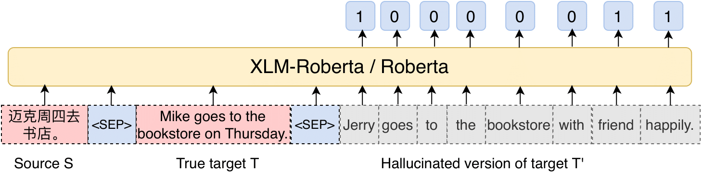

# Detecting Hallucinated Content in Conditional Neural Sequence Generation
This repository contains codes for running hallucination detection from the following [paper](https://arxiv.org/abs/2011.02593).
```
Detecting Hallucinated Content in Conditional Neural Sequence Generation
Chunting Zhou, Graham Neubig, Jiatao Gu, Mona Diab, Paco Guzman, Luke Zettlemoyer, Marjan Ghazvininejad
ACL-Finding 2021
```
<br>


<br>

## Requirement
- This repo is based on [fairseq](https://github.com/pytorch/fairseq) (tag [v0.7.0](https://github.com/pytorch/fairseq/releases/tag/v0.7.0))
(please follow the instructions in the fairseq repo for requirements on apex, Python and Pytorch version.)

Under your anoconda environment, please install fairseq from source locally with:
```shell script
python setup.py build_ext --inplace
```

We will explain to you how to train a hallucination model on your own bi-text dataset and make predictions.
## Data
### 1. Training data used in the paper

We used the large multi-domain data set collected in this [paper](https://arxiv.org/pdf/1911.09912.pdf) (Wang et al., 2020), which includes four domains (law, news, patent, tvsubtitles).
Since it involves the data from LDC, we could not publish it.

### 2. Human annotation benchmarks 

We have two benchmark datasets for MT and summarization (XSum) respectively in this repo (`./eval_data/`). 
#### Machine Translation (`./eval_data/mt/`): 
We train two MT systems (standard Transformer and finetuned [MBART](https://github.com/pytorch/fairseq/tree/master/examples/mbart)) on the simulated low-resource (patent domain) training data, and evaluate on the patent domain. 
We ask bilingual speakers to evaluate if machine translations contain hallucinations at token-level on 150 sentences from the patent test set.
Under `./eval_data/mt/`, `*source` are raw source sentences, `*target` are model outputs, `*ref` are references, `*label` are annotated labels of `*target`.
`1` indicates hallucinated words and `0` indicates faithful translation words.
- `./eval_data/mt/trans2s.*` are annotations for standard Transformer outputs.
- `./eval_data/mt/mbart.*` are annotations for finetuned MBART outputs.
#### XSum
We processed the annotations released from [google](https://github.com/google-research-datasets/xsum_hallucination_annotations) by aggregating the labels for each word from 3 annotators with majority voting.
The aggregated results for four models (BERTSeq2Seq, Pointer-generator, Topic-aware Convolutional Network and standard Transformer Seq2Seq) are under `./eval_data/xsum/`.

## Create Synthetic Data
To train a hallucination prediction model on your own bi-text dataset, the first step is creating the synthetic labeled data.
This is decomposed into the following two sub-steps.
- **Generate synthetic target data with BART**

  You can tune the hyperparameters for generating noised data at the top of `./util_scripts/run_gen_synthetic_data_with_bart.sh`, then run the following command.
  The set of noise hyperparameters will be used to name the output, namely `config`.

  Please first download the BART (for English, [here](https://github.com/pytorch/fairseq/tree/master/examples/bart)) or MBART (for other languages, [here](https://www.dropbox.com/sh/rf1yx5ic1rmprbq/AACPGueHCjJpGj_1VS-I03PYa?dl=0), we noticed that the MBART model released in fairseq is broken) model
and then specify the path to model and bpe dictionary in `Line 33-45` of `./util_scripts/gen_bart_batch.py`.
  Then run the following command:
  ```commandline
  bash ./util_scripts/run_gen_synthetic_data_with_bart.sh path/to/the/target/file path/to/the/valid/file
  ```
  e.g.,
  ```commandline
  bash util_scripts/run_gen_synthetic_data_with_bart.sh toy_data/train.en toy_data/valid.en
  ```
  With the default setting, the noise `config=mask_0.0_0.6_random_0.0_0.3_insert_0.2_wholeword_0`.
  After this, a new directory `bart_gen` is created under the directory of your input and you will see the output under `bart_gen`.
 
- **Create pseudo labels and binarize datasets**

  The examples scripts `./util_scripts/make_synthetic_data_mt.sh` and `./util_scripts/make_synthetic_data_xsum.sh` 
are used for pseudo label creation and dataset binarization for machine translation and summarization respectively.

  You need to download the model you will finetune on later and the corresponding dictionaries prior to the following steps.
To predict hallucination for a cross-lingual conditional sequence generation task, e.g. MT, you could use [XLM-Roberta](https://github.com/pytorch/fairseq/tree/master/examples/xlmr);
to predict hallucination for a monolingual conditional sequence generation task, e.g. summarization, you could use [Roberta](https://github.com/pytorch/fairseq/tree/master/examples/roberta).

  These models also come along with the dictionaries and the subword models (sentencepiece for XLM-R, and gpt-2 bpe for Roberata).
Following is an example processing script when finetuning XLM-R model:
  ```commandline
  bash ./util_scripts/make_synthetic_data_mt.sh config directory/of/target/data path/to/sentencepiece/model path/to/dictionary 
  ```
  e.g.,
  ```commandline
  bash util_scripts/make_synthetic_data_mt.sh mask_0.0_0.6_random_0.0_0.3_insert_0.2_wholeword_0 toy_data path/to/xlmr.large/sentencepiece.bpe.model path/to/xlmr.large/dict.txt
  ```
  Similarly, you can run for Roberta model with example script `./util_scripts/make_synthetic_data_xsum.sh`. Please see the scripts for more details.

  After this step, you will see the binarized datasets with source, target, reference and labels under a new directory `data` under `directory/of/target/data`.

## Train a Hallucination Detection Model
You can finetune XLM-R or Roberta with the above created binarized data.
We provide the batch scripts to run this for MT and abstractive summarization respectively.
```commandline
sbatch ./train_exps/example_finetune_mt.sh path/to/the/binarized/data
```
or 
```commandline
sbatch ./train_exps/example_finetune_xsum.sh path/to/the/binarized/data
```
You may want to tune the hyperparameters inside the scripts for better performance, such as --dropout-ref (dropout reference words to prevent the model from learning edit distance), --max-update, etc.

## Evaluation
We provide the evaluation scripts for the benchmark datasets under `./eval_data`.
To evaluate on these datasets, we provide python scripts `./util_scripts/eval_predict_hallucination_mt.py` and
`./util_scripts/eval_predict_hallucination_xsum.py` for MT and summarization respectively (they only differ slightly).
First, you need to specify the path to the saved detection model directory and training data path in `Line 12-13`, then run them.

## Pretrained Models
You can download our trained models for these benchmark datasets for [zhen-MT](https://dl.fbaipublicfiles.com/detect-hallucination/zhen.mt.xlmr.tar.gz) and [XSum](https://dl.fbaipublicfiles.com/detect-hallucination/xsum.roberta.tar.gz), and evalutate them with the above scripts by first setting the `models` to be `['path/to/the/unzipped/folder']` and `datapath` to be the folder of data inside the unzipped file.

## Prediction
To simply use the trained model for hallucination prediction for your own input, we provide an example script `./util_scripts/predict_hallucination_mt.py`
that predicts labels for a hypothesis file conditioned on its source file.
Again, please specify the path to your input files, the trained model, the training data and the output directory in `Line 12-23`, and then run it.

## Scripts for Word-level Quality Estimation
The directory `word_level_qe/` contains scripts for both supervised and unsupervised experiments for word-level quality estimation from the [WMT18 shared task](http://www.statmt.org/wmt18/quality-estimation-task.html) (task 2 of QE). 

## Reference
```
@inproceedings{zhou21aclfindings,
    title = {Detecting Hallucinated Content in Conditional Neural Sequence Generation},
    author = {Chunting Zhou and Graham Neubig and Jiatao Gu and Mona Diab and Francisco Guzmán and Luke Zettlemoyer and Marjan Ghazvininejad},
    booktitle = {Findings of the Joint Conference of the 59th Annual Meeting of the Association for Computational Linguistics and the 11th International Joint Conference on Natural Language Processing (ACL-IJCNLP Findings)},
    address = {Virtual},
    month = {August},
    url = {https://arxiv.org/abs/2011.02593},
    year = {2021}
}
```
